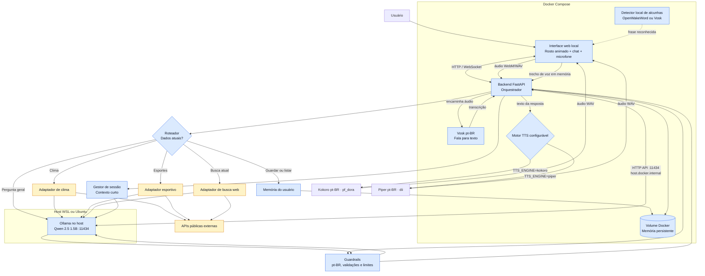
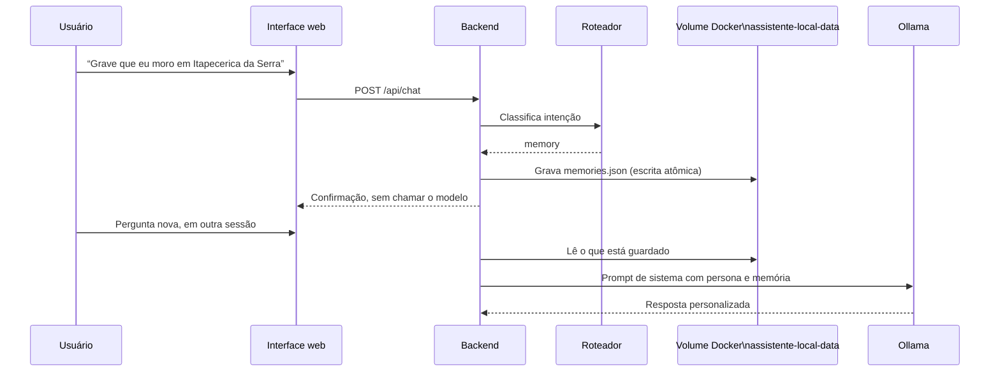

# Arquitetura do Assistente Local

## Fluxo de uma pergunta

## Memória persistente

O volume nomeado `assistente-local-data`, montado em `/data`, é storage do Docker: sobrevive a
`down`/`up` e à recriação do container. A gravação usa arquivo temporário + `os.replace`, e um
`memories.json` ilegível é preservado com o sufixo `.corrupt-<timestamp>.json` em vez de ser
sobrescrito. O bloco injetado no prompt respeita `MEMORY_PROMPT_CHARS` e é marcado como dado,
nunca como instrução. Se o volume falhar, o backend responde com aviso e mantém o chat de pé.

## Hospedagem do Ollama

| Cenário | Onde roda | Como o container alcança | Medido com qwen2.5:1.5b |
| --- | --- | --- | --- |
| Preferido: Windows com GPU | `ollama serve` no Windows, com `OLLAMA_HOST=0.0.0.0:11434` | `http://<gateway-do-WSL>:11434` | ~193 tokens/s (Radeon RX 9070 XT) |
| Reserva: WSL | `ollama serve` na distribuição Linux | `http://host.docker.internal:11434` | ~34 tokens/s (CPU) |

`scripts/ensure-ollama.sh` decide qual usar, grava a escolha em `data/ollama-mode.env` e o
bootstrap exporta `OLLAMA_BASE_URL` para o Compose. Rotas, prompts e ferramentas são idênticos
nos dois casos: muda apenas o host que gera o texto.

## Fronteiras de rede

| Origem | Destino | Permitido quando |
| --- | --- | --- |
| Navegador | Backend | Sempre, pela rede local. |
| Backend | Vosk e Kokoro | Sempre, dentro do Compose. |
| Backend | Ollama no host, porta `11434` | Sempre que gerar resposta, pela rota configurada de host gateway. |
| Backend | APIs externas | Somente quando o roteador aciona uma ferramenta. |
| Internet | Serviços internos | Nunca diretamente. |
