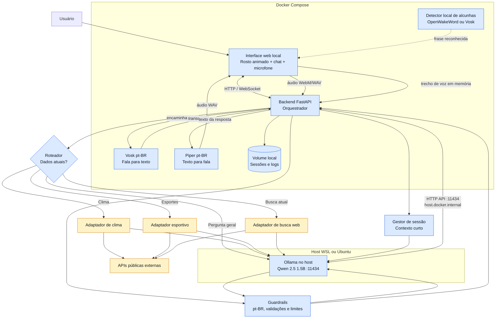
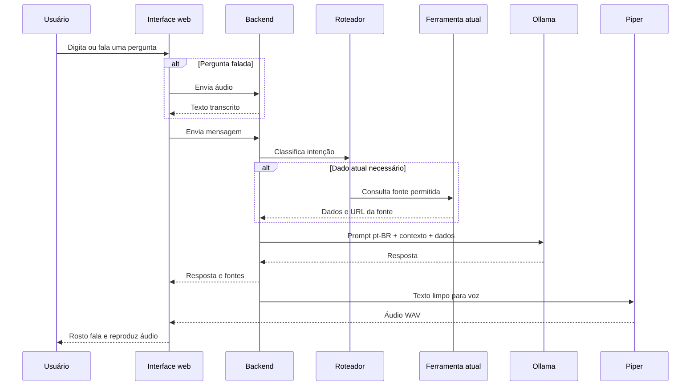

# Arquitetura do Assistente Local

## Fluxo de uma pergunta

## Fronteiras de rede

| Origem | Destino | Permitido quando |
| --- | --- | --- |
| Navegador | Backend | Sempre, pela rede local. |
| Backend | Vosk e Piper | Sempre, dentro do Compose. |
| Backend | Ollama no host, porta `11434` | Sempre que gerar resposta, pela rota configurada de host gateway. |
| Backend | APIs externas | Somente quando o roteador aciona uma ferramenta. |
| Internet | Serviços internos | Nunca diretamente. |
